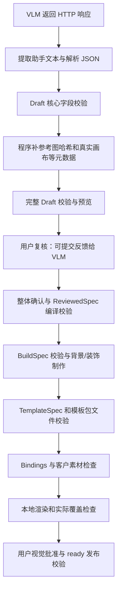

# Figcopy 校验逻辑审查与修复方案

日期：2026-09-14  
代码基准：`85e7c3c`  
性质：代码审查、离线复现和实施建议；图形字段部分已实施。

> 2026-09-14 实施更新：图形字段与 prompt 已修改，完整离线测试 312 项通过。详见 [图形字段验证](benchmarks/shape_fields/README.md)。本文的问题描述和 results.json 保留为 `85e7c3c` 基线证据；响应恢复、羽化参数等其余建议仍待实施。

## 1. 结论

校验应该约束“含义是否明确、值是否安全、后续是否可执行”，不能把所有像素参数都当成整数，也不能对不同图形强制填写同一组无关参数。

建议修正 schema 和调用边界：圆角半径直接接受有限小数；线宽、虚线步长等离散参数继续使用整数；Draft 按动作和图形类型校验；确定性的本地检查提前；模型已返回的响应先保存，再解析/校验和恢复。

前一轮按整数增加兼容转换的临时业务代码已撤回，撤回前逐文件验证没有夹带其他修改。审查记录基于上述代码；后续图形字段实施见文首更新。审查阶段新增本报告与 `benchmarks/validation_contract/` 诊断材料，没有更改 test2、调用真实模型、代替用户确认或发布模板。

## 2. 本次 radius 报错能证明什么

日志中的路径为 `$.overlays[0..2].shape.radius`，错误码 `INVALID_TYPE`。这能证明三个字段未通过 Python 整数类型检查，不能证明当时的值具体是小数、字符串还是 null。

实际检查点：

- [图形校验](collage/schemas/template.py)：`_validate_shape`，第 32 行；第 54 行对 radius 调用 `_integer`。
- [基础整数校验](collage/schemas/common.py)：`_integer`，第 110 行；第 118 行拒绝 bool 和一切非 int。
- [Draft 调用点](collage/schemas/draft.py)：第 109 行复用图形校验。
- [绘图调用点](collage/template/build/overlays.py)：`_make_basic_shape`，第 69 行；仅 rounded_rectangle 分支使用 radius。

本机 Python 3.14.6 / Pillow 12.3.0 的离线结果：

| 输入 | 当前 Draft 校验 | 实际图形绘制 | 判断 |
|---|---|---|---|
| 圆角框 radius=8.5 | 拒绝 | 成功 | schema 限制过严 |
| 圆角框 radius=8.0 | 拒绝 | 成功 | Python 类型限制，不是数值问题 |
| 圆角框 radius=null | 拒绝 | TypeError | 值不明确，不能直接放行 |
| 普通矩形 radius=null | 拒绝 | 成功 | 当前图形不使用该参数 |
| 普通矩形省略 radius/dash/gap | 拒绝 | 成功 | 要求了无关字段 |
| 线宽 width=2.0 | 拒绝 | TypeError | 真有整数运行约束，需先无损规范化 |
| 虚线间隔 gap=2.0 | 拒绝 | TypeError | 当前 range 步长依赖整数 |

test2 的 analysis 目录只有规范化参考图和策略文件，未保存失败响应。因此本次不能恢复那三个实际 radius，也不能把上述合成案例声称为原始模型输出。

## 3. 当前校验链路



| 阶段 | 当前实现 | 主要检查内容 |
|---|---|---|
| 响应提取 | [providers/yibu/vision.py](collage/providers/yibu/vision.py) | 输出是否截断、有无助手文本、是否可解析为包含五个顶层字段的 JSON；不是完整的字段校验 |
| 基础类型和字段 | [schemas/common.py](collage/schemas/common.py) | object/list/string/bool/int/number；必填和未知字段；枚举、ID、坐标、画布 |
| 候选 Draft | [schemas/draft.py](collage/schemas/draft.py) | slots、overlays、背景分支、图层引用、问题列表；有画布时检查源框范围 |
| 补元数据 | [template/analysis.py](collage/template/analysis.py) | reference 哈希、真实画布、来源审计由程序生成；再执行完整 Draft 校验 |
| 交互确认 | [studio/review_session.py](collage/studio/review_session.py) | 版本是否过期、整体确认、文字接受记录、反馈纠正、背景选择、mask 等；无反馈可整体确认的现行规则保持有效 |
| 制作规格 | [schemas/reviewed.py](collage/schemas/reviewed.py)、[template/review/service.py](collage/template/review/service.py) | 必填制作参数、背景/mask、字体、照片模式、精确素材、动作对应的 shape、确认来源 |
| 模板文件 | [template/validation.py](collage/template/validation.py) | 安全相对路径、PNG 可解码、哈希、尺寸、透明像素、mask/字体、发布状态 |
| 客户输入 | [schemas/bindings.py](collage/schemas/bindings.py)、[rendering/](collage/rendering/) | 槽位对应关系、图片/文字、scale/offset；抠图和实际照片背景覆盖检查 |
| 发布 | [template/build/approval.py](collage/template/build/approval.py) | 待批准状态、fixture 限制、验收图尺寸和哈希、真人批准信息；批准后再次检查模板包 |

几个容易混淆的点：

1. 这是一套手写 Python 校验器，不是自动执行完整 JSON Schema 的库。模型拿到的是手写提示词和示例；程序实际规则与提示词可能脱节。
2. `_integer` 看 Python 类型，`8.0` 会解析成 float。JSON Schema 语境下“数学上为整数”和这里的 `isinstance(value, int)` 并不相同。
3. `_validate_shape` 虽放在 template.py，实际由 Draft 和 ReviewedSpec 共享。最终发布模板的固定图形已制作成 PNG，通常不再携带 radius；修改半径契约主要影响制作阶段。
4. `require_metadata=False` 仍会校验模型提供的可选 canvas；真实画布随后由程序补齐。第一次核心校验与完整几何校验是两次检查。
5. 结构正确不代表视觉正确。透明 PNG、正确哈希、有效坐标也不能证明文字无误、无旧照片残留或构图合格。

## 4. 已确认的问题及类似风险

### V01：连续长度被统一限制为整数

除 radius 外，`edge_fade_px` 和固定背景 `feather_px` 也使用整数校验。

- `edge_fade_mask((20,20), 2.5)` 实际成功；
- `make_blend_mask(..., feather_px=2.5)` 实际成功；
- ReviewedSpec 的上述字段仍被 `_integer` 限制。
- `edge_fade_px` 还涉及 [review/defaults.py](collage/template/review/defaults.py) 的 `isinstance(fade, int)`、TemplateSpec 和页面输入，不能只改一处 schema。

这些是相似的契约限制。需要覆盖各入口后决定支持范围；不是 test2 当前 radius 报错的直接原因。

### V02：图形参数没有按 kind 区分

四类图形统一要求七个字段：

- rounded_rectangle 才使用 radius；
- dashed_rectangle 才使用 dash/gap；
- rectangle、ellipse 不使用这三个参数。

当前缺一个无关参数会先产生 `MISSING_FIELD`，随后对缺失值再次产生 `INVALID_TYPE`，既误阻塞，也重复报错。应将“这个类型需要哪些参数”写成条件规则。

### V03：Draft 与制作规格对 action/shape 的要求不同

- Draft 接受 `basic_shape` 不带 shape；确认编译会把 action 改成 `reference_generate`。
- 这是现有兼容逻辑，有日志和说明记录，不能称为完全无提示；但复核页按原 action 显示“简单图形由程序绘制”，与随后采用图片模型的行为可能不一致。
- 相关注释仍写“DraftSpec 不包含可执行 shape”，与现有 Draft 支持 shape 的事实不符。
- 反向也有不一致：`reference_generate` 带合法 shape 能通过 Draft，确认时又因“shape 必须为 null”失败。已用完整的本地 analyze → confirm 入口复现。

应统一新模型输出的 action 合约。旧稿兼容路径保留并明确展示最终动作；不能把缺少几何参数自动变成不明显的付费生成。

### V04：无文字的表示方式不统一

Draft 的可选 `text_content` 接受 null，却拒绝空字符串。UI 则显示“无文字则留空”，再在提交时转为 null。模型若自然地输出空字符串，会在进入页面前失败。

建议在模型输入适配边界统一“无文字”的表示，保留原响应。不能清空非空文字、修改识别内容或代替文字确认。

### V05：颜色检查太晚

shape.fill / shape.outline 仅被检查为字符串或 null。`outline="#GGGGGG"` 通过 Draft，在实际绘图时才报 `INVALID_COLOR`。

背景制作早于装饰绘制，因此这类完全可以本地发现的问题可能在背景调用后才暴露。应使用与绘图一致的颜色解析器，在制作前给出字段路径错误。

### V06：部分确定性几何/绑定错误检查太晚

- `target_rect=[1,1,0.1,18]` 通过正宽高校验，进入 `rect_to_box` 后取整为零宽，才报 `INVALID_RECT`。
- `cover` 槽的 `scale=0.5` 通过 Bindings 的通用 0.05..20 检查，拟合时才报 `INVALID_BINDING_SCALE`。
- 这些是“错误已经有保护，但保护位置偏后”，不是最终渲染会放行错误。
- 极大 target_rect 也能通过当前尺寸规则。诊断仅做 schema 检查，没有尝试分配巨型图片；内存耗尽属于待防护风险，不声称已发生。

建议在知道画布、fit 和执行尺寸的边界提前检查；保持允许装饰部分越出画布的既有语义，不能简单要求所有 target_rect 都在画布内。

### V07：校验器遇到错误类型会自己抛异常

已复现：

- `shape.kind=[]`：`value not in allowed` 对 set 做成员判断，抛 `TypeError`；
- 坐标为极大 JSON 整数：`math.isfinite(float(value))` 抛 `OverflowError`。

期望是聚合成带字段路径的稳定业务错误，而不是变成 `WORKBENCH_JOB_FAILED`。应先检查类型，再枚举判断；整数范围与浮点有限值分开处理，并覆盖其他直接 set 成员判断。

### V08：分析响应没有在校验前保存

[template/analysis.py](collage/template/analysis.py) 第 178–179 行先 validate，再写 cache：

- 不合法的已返回 Draft 不会落盘；
- 下一次 resume 没有可复用的响应；
- 离线 fixture 中，同一个无效 radius 连续分析两次，provider 被调用两次；
- 最后只留下 analysis_policy.json 和 reference.png。

已有反馈纠正流程 [review/feedback.py](collage/template/review/feedback.py) 会先保存 response.json，值得复用这一设计。新分析应区分“已收到原响应”和“已通过校验的可用缓存”。

补充静态发现：分析缓存键含参考图哈希、prompt_version、policy、provider 名和模型名，但未包含实际完整提示词、推理强度和输出预算。修响应恢复时应一起明确请求指纹；不要改了本地校验就自动发起新的模型调用。

### V09：诊断信息未完整保留

校验项有 path/message/code，但工作台终端只打印前五项的 path/code；项目持久化 last_error 只保留概括性的 code/message，详细错误主要留在当前进程任务记录里。

建议记录安全的字段路径、期望类型、实际类型、原因及数量。数值字段可展示受限的实际数值；客户文字、原图、密钥和制作端路径不应写入通用日志。

## 5. 建议的新字段契约

### 5.1 不同字段使用不同规则

| 字段 | 建议 | 原因 |
|---|---|---|
| radius（圆角框） | 0..8192 的有限 number，保留 8.5 | 连续几何长度；底层可处理小数 |
| radius（其他图形） | Draft 可省略或 null；编译时填规范的未使用值 | 不参与绘图，不要求模型编造参数 |
| width | 0..1024 整数 | 当前 Pillow 绘图接口依赖整数 |
| dash/gap（虚线框） | 保留整数与现有范围 | 自定义绘制用 range 步长 |
| dash/gap（非虚线） | Draft 可省略或 null；编译时填规范的未使用值 | 不参与该类图形 |
| edge_fade_px | 可考虑 0..4096 有限 number，贯通复核、模板和 UI | 算法支持连续羽化宽度 |
| feather_px | 可考虑 0..4096 有限 number | GaussianBlur 支持小数 |
| expand_px | 保留整数 | 当前 MaxFilter 的核尺寸必须是合法离散值 |
| 画布 width/height、max_lines | 保留整数 | 图像栅格尺寸、列表切片/计数 |
| rect、rotation、scale、offset | 继续支持有限 number，增加执行前检查 | 这些字段已经支持小数，不应一并取整 |
| fill/outline/color | 可解析的色值；空值按字段语义处理 | 非空字符串不等于合法颜色 |

font_size、line_spacing 等其他像素字段也应按实际调用逐个评估；本轮没有逐项完成它们的跨版本渲染验证，不能据“Pillow 一般支持浮点”直接批量放宽。

### 5.2 模型类型适配仅做明确、无损的转换

- radius 的 JSON number 直接验证：8、8.0、8.5 都可保留。
- 真正要求整数的字段，可以在模型适配边界把 2.0 变为 2，再执行严格内部校验。
- 不把 2.5 四舍五入为 2 或 3，不用截断掩盖差异。
- 数字字符串不建议第一版泛化接受；如要支持，应限于指定字段、明确语法并记录转换，不能递归地把任意字符串“猜成”数值。
- 圆角框 radius=null 是缺少有效几何信息，应提示纠正或复核，不能默认成直角。
- 非圆角图形的未使用半径、无文字的空值属于可定义的无语义默认化；原始响应和规范化记录分别保留。
- 严禁在此层改照片数量、ID、文字内容、背景来源、图层顺序或批准信息。

### 5.3 分清三个边界

1. **模型原始响应**：留证据，不作为成功结果。
2. **可复核 Draft**：类型/结构/源图范围正确；未决语义保持可见，不伪造答案。新 basic_shape 缺少有效参数时需显式问题或诊断状态。
3. **可执行 ReviewedSpec**：所有实际参与执行的参数完整、动作明确、可本地预检；确认后才执行生成。

内部验证函数负责检查；独立的输入适配/确认编译负责转换。不要偷偷让通用校验器修改用户或已发布的数据。

## 6. 实施顺序和验收

此工作属于当前 A2/1.5 流程修复和 A5 恢复约束补强，不需要重写渲染器或引入新框架。

| 顺序 | 改动范围 | 验收 |
|---|---|---|
| P0 | 把 `_validate_shape` 提取到共享图形契约模块；radius 改为 number；按 kind 明确参数；新模型 action 与 shape 一致 | 8/8.0/8.5 可经分析、确认、构建出图；null 圆角半径仍拒绝；普通矩形无关参数不阻塞；旧整数素材像素不变 |
| P0 | 防止校验器 TypeError/OverflowError；保留稳定业务 code | 错误枚举类型、极大数、NaN/Infinity、bool 都产生受控的字段错误 |
| P0 | 先保存已收到响应与审计，再校验；本地恢复与模型重发分开 | 同一已返回响应修复校验后能恢复，不新增模型调用；原响应哈希不变；未恢复成功时不标成 Draft 成功 |
| P1 | 颜色、取整后矩形、cover 缩放及资源尺寸预检 | 这些确定性错误在背景/装饰模型调用前被发现，报告具体字段 |
| P1 | 问答纠正、CLI、工作台、人工导入使用一致的最终契约；修 action 回退说明和旧注释 | 修改动作不会只发生在后台；旧半自动流程可用；有反馈须纠正、无反馈整体确认规则不退化 |
| P1 | 补充完整模型字段合约/合法示例；统一契约版本与缓存指纹；持久化安全诊断 | 提示样例实际通过程序校验；本地修复不等于切换模型/重发 |
| P2 | 羽化等其他连续参数逐一贯通；像素和回归验证后开放 | 复核、编译、模板、UI 对同一值作一致判断；不批量替换所有 _integer |

响应恢复还需处理：原图/策略/模型不匹配、文件损坏、写入中断、超时或未知请求状态。已收到响应优先本地恢复；未知请求不自动当作“没调用过”；明确需要新模型请求时，使用现有模型和可见的重试动作。不要让“忽略失败缓存”成为隐含重发。

成功缓存应在完整 Draft 和必要的本地可执行检查通过后标记可用；请求指纹与本地处理规则版本分开，避免本地代码修复导致重新计费。

建议保留现有整数稿的读取和像素语义，新版本只扩展所声明的数值能力。若新增不兼容字段/状态，遵循主计划的版本约定；不批量改写旧确认稿、旧模板或验收记录。

必须继续严格验证：ID/图层引用、源图哈希、源框边界、mask 坐标空间、真实 alpha、客户照片满版覆盖、精确文字授权、密钥与安全路径、真人确认和发布状态。此次改动不构成视觉质量验收。

## 7. 实际产物与复现

- [诊断程序](benchmarks/validation_contract/probe.py)
- [22 个案例的机器结果](benchmarks/validation_contract/results.json)
- 本机环境：Python 3.14.6、Pillow 12.3.0。
- 全部为合成图、内存绘图或 fixture provider；真实模型调用数为 0。
- “22 个诊断案例已运行”不等于“22 项修复测试通过”：其中多项故意触发当前错误，用于确认现状。
- 小数绘图结果是本机 Pillow 12.3.0 的证据；声明支持的其他 Pillow 版本仍需后续兼容回归。

仓库根目录运行：

```powershell
python -B -m benchmarks.validation_contract.probe
```

命令会写入同目录 results-current.json；results.json 保留为审查基线。少量合成分析材料保存在新建系统临时目录中，不读取或改写真实项目。异常输出只保存错误类型、业务 code 和受控字段信息。

**真实 test2：仍在识别失败阶段；原响应缺失，真实模型修复效果未验证。本报告不给出已修复或已验收的结论。**
